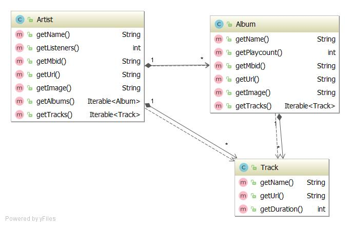

# Enunciado do Trabalho 1

**Data limite de entrega: 31 de Março**

**Objectivos**: Prática com funções de primeira classe, expressões lambda,
funções de ordem superior, `Iterable<T>`

**NOTA**: 
1.  A solução entregue deve incluir todos os testes unitários necessários para
    validar o correcto funcionamento das funcionalidades pedidas.
2.  Este trabalho deve ser desenvolvido usando como base o projecto Gradle
    **jingle** disponibilizado em https://github.com/isel-leic-mpd/jingle.
    Copie toda a solução incluindo o ficheiro .gitignore para o repositório
    Github do grupo de MPD.
3.	Cada trabalho será desenvolvido num novo módulo dentro do projecto **jingle**.

Implemente o módulo **jingle-lazy** que disponibiliza informação detalhada sobre
artistas, álbuns e músicas.
Os dados são obtidos a partir de uma API RESTful: https://www.last.fm/api. 
O modelo de domínio é formado pelas entidades: `Artist`, `Album` e `Track` e
obedece à especificação apresentada no diagrama de classes seguinte:

 

As classes do modelo de domínio estão implementadas no módulo **jingle-lazy**.
Todas as relações entre as entidades de domínio são mantidas de forma lazy.

A instanciação e navegação dos objectos de domínio é feita por `JingleService` que
recorre à classe `LastfmWebapi` para realizar os pedidos à Web Api de last.fm.
 
 

## 1. **jingle-util** `LazyQueries`

O módulo **jingle-lazy**  recorre a **jingle-util** para executar tarefas
auxiliares tais como operações sobre sequências implementadas pela classe
`LazyQueries`.
Implemente em `LazyQueries` as seguintes operações e os respectivos testes
unitários que verifiquem o seu correcto funcionamento, pela seguinte ordem:

1. Baseando-se nas implementações dadas nas aulas, implemente os métodos
   `filter()`, `skip()`, `limit()`, `map()`, `generate()`, `iterate()`,
   `count()` e `toArray()` de modo a passar os respectivos testes unitários
   definidos em `LazyQueriesTest`. Pode adicionar outros testes unitários.
2. Baseando-se nas implementações dadas nas aulas, implemente os métodos
   `first()` e `max()`. Note que o tipo de retorno destes métodos é
   `Optional<T>`.
3. `last(Iterable<T> src)` - retorna o último elemento da sequência `src`.
4.  `from(T[] items)` - retorna uma nova sequência lazy com os elementos de
  `items`.
5. `takeWhile(Iterable<T> src, Predicate<T> pred)` - retorna uma nova sequência
  lazy com os primeiros elementos de `src` que verificam o predicado `pred`
6. `flatMap(Iterable<T> src, Function<T, Iterable<R>> mapper)` - retorna uma nova
  sequência lazy com o resultado das transformações de cada elemento de `src`
  pela função `mapper` num `Iterable<R>` combinados numa única sequência.
  Exemplo, dada uma sequência de palavras: “isel”, “super”, “ola”, então uma
  operação de `flatMap` sobre esta sequência com uma transformação de `String ->
  Iterable<char>`, deve resultar num `Iterable<char>` com: `‘i’, ‘s’, ‘e’, ‘l’,
  ‘s’, ‘u’, ‘p’, ‘e’, ‘r’, ‘o’, ‘l’, ‘a’`.


## 2. **jingle-lazy** `LastFmWebAPI`

Implemente os métodos de `LastFmWebAPI` de modo a passar os testes unitários de
`LastfmWebApiTest`. 
Deve implementar outros testes unitários além dos fornecidos.
Note que terá que adicionar outras classes DTO além das fornecidas de modo a
definir um grafo compatível com os dados retornados pela Web API.
Deve usar **exclusivamente** os dados das seguintes rotas da Web API last.fm:

  * https://www.last.fm/api/show/artist.search -- pesquisa artistas com um dado
    nome.
  * https://www.last.fm/api/show/artist.getTopAlbums -- obter os albums de um
    artista identificado pelo seu mbid.
  * https://www.last.fm/api/show/artist.getInfo -- obter as músicas (_tracks_)
    de um álbum identificado pelo seu mbid.

Os resultados da API RESTFul podem ser convertidos através da biblioteca Gson
para instâncias de classes pré-definidas (DTOs).

**NOTA:** no caso de propriedades em JSON que contenham carácters que sejam 
inválidos em Java poderá usar a anotação Gson `@SerializedName` sobre o respectivo
campo com o nome da propriedade Json, e.g. `@SerializedName("#text")`.

## 3. **jingle-lazy** `JingleService`

Implemente os métodos de `JingleService` de modo a passar os testes unitários de
` JingleServiceTest`. 
Deve implementar outros testes unitários além dos fornecidos. 
Note que alguns dos métodos de `LastfmWebapi` recebem um segundo parâmetro
inteiro correspondente ao número da página.
Nestes casos o método correspondente de `JingleServive` deve retornar um iterável
que percorre os elementos de todas as páginas disponíveis até ser obtida uma
página sem elementos.
Para tal deve executar um encadeamento de operações semelhante ao seguinte:

`iterate(…) -> 1,2,3,.. -> map(invoque LastfmWebApi) -> arr1, arr2, …  -> takeWhile(arr.length != 0) -> flatMap(from(arr)) -> map(dto -> model)`

No caso do método `getTracks(String artistMbid)`, repare que este recorre aos 2
métodos `getAlbums` e `getAlbumsTracks` para obter todas as músicas do artista
identificado por `artgistMbid`.


## 4. **jingle-util** `LazyQueries::cache`

Note que no teste `searchHiperAndCountAllResults` ao percorrer duas vezes a
mesma sequência de `artists` são repetidos todos os pedidos HTTP.
Implemente em `LazyQueries` uma função utilitária `cache()` que pode ser
aplicada a qualquer sequência retornando uma nova sequência do mesmo tipo, e.g.
`artists = cache(artists)`.
A sequência resultante deve guardar em memória os elementos que vão sendo
obtidos por um iterador.
O método `next()` retorna sempre os elementos que já estejam guardados em
memória e só obtém um novo elemento caso este não esteja _cached_.
Exemplo de utilização do método `cache()` sobre uma sequência infinita:

```java
Random r = new Random();
Iterable<Integer> nrs = generate(() -> r.nextInt(100));
nrs = cache(nrs);
Object[] expected = toArray(limit(nrs, 10));
Object[] actual = toArray(limit(nrs, 10));
assertArrayEquals(expected, actual);
```

Verifique o correcto funcionamento desta função confirmando que não são feitos
novos pedidos HTTP no teste `searchHiperAndCountAllResults` ao percorrer mais
que uma vez a mesma sequência retornada por `JingerService`.
